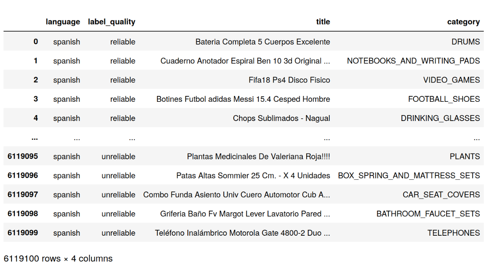
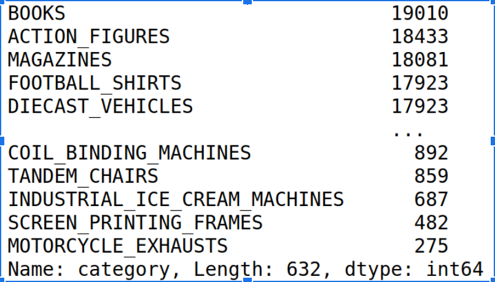
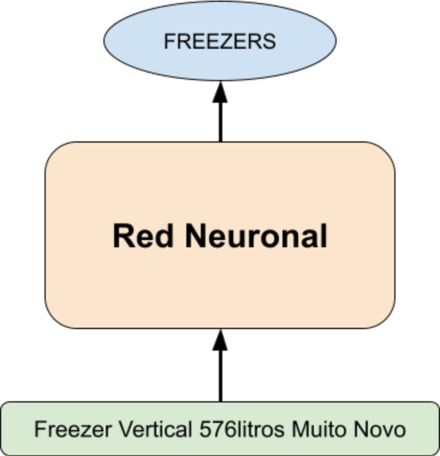

# Aprendizaje Profundo: Práctico 

En este práctico trabajaremos en el problema de clasificación de texto del MeLi Challenge 2019.

El datasets tiene información acerca de títulos de publicaciones, categoría de los mismos, información de idioma y confiabilidad de la anotación.
Cuenta con anotaciones de títulos para 632 categorías distintas.

El dataset también cuenta con una partición de test que está compuesta de 63680 de ejemplos con las mismas categorías
(aunque no necesariamente la misma distribución).

También hay datos en idioma portugues, aunque para el práctico de esta materia basta con usar uno solo de los idiomas.

## Ejercicio:
Implementar una red neuronal que asigne una categoría dado un título.
Para este práctico se puede usar cualquier tipo de red neuronal. Les que hagan solo la primera mitad de la materia,
implementarán un MLP. Quienes cursan la materia completa, deberían implementar algo más complejo, usando CNNs,
RNNs o Transformers.

Algunas consideraciones a tener en cuenta para estructurar el trabajo:

  1. Hacer un preprocesamiento de los datos (Cómo vamos a representar los datos de entrada y las categorías?).
  2. Tener un manejador del dataset (alguna clase o función que nos divida los datos en batches).
  3. Crear una clase para el modelo que se pueda instanciar con diferentes hiperparámetros
  4. Hacer logs de entrenamiento (reportar tiempo transcurrido, iteraciones/s, loss, accuracy, etc?).
  5. Hacer un gráfico de la función de loss a lo largo de las epochs.
  6. Reportar performance en el conjunto de test con el mejor modelo entrenado. La métrica para reportar será balanced accuracy ([Macro-recall](https://peltarion.com/knowledge-center/documentation/evaluation-view/classification-loss-metrics/macro-recall)).

## Ejercicios opcionales:
  1. Se puede tomar una subconjunto del train para armar un set de validation para probar configuraciones, arquitecturas o hiperparámetros (cuidado con la distribución de este conjunto). En dicho caso, reportar la performance de cada experimento sobre validación antes de reportar sobre test.
  2. Usar word embeddings en lugar de one-hot encodings. Estos pueden ser aprendidos o precomputados.
  3. Se puede usar todos los datos (spanish & portuguese) para hacer un modelo multilingual para la tarea. Qué cosas tendrían que tener en cuenta para ello?

Adicionalmente, se pide un reporte de los experimentos y los procesos que se llevaron a cabo (en formato pdf). 
No se evaluará la performance de los modelos, sino el proceso de tomar el problema e implementar una solución con aprendizaje profundo.
